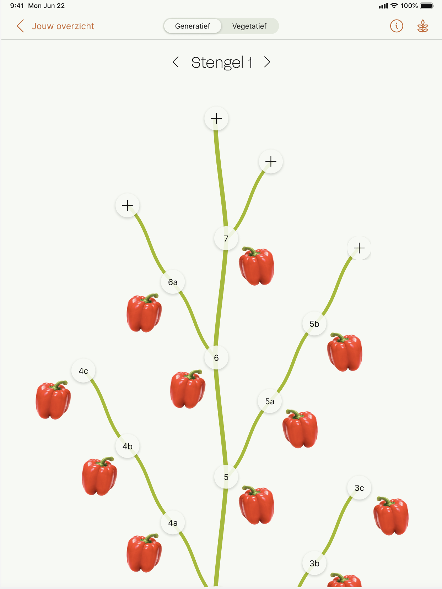
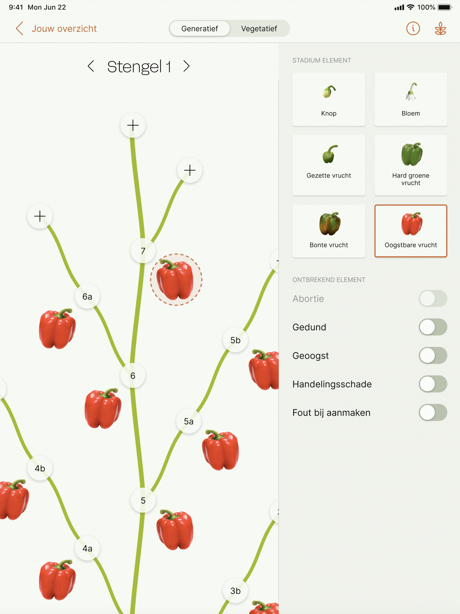
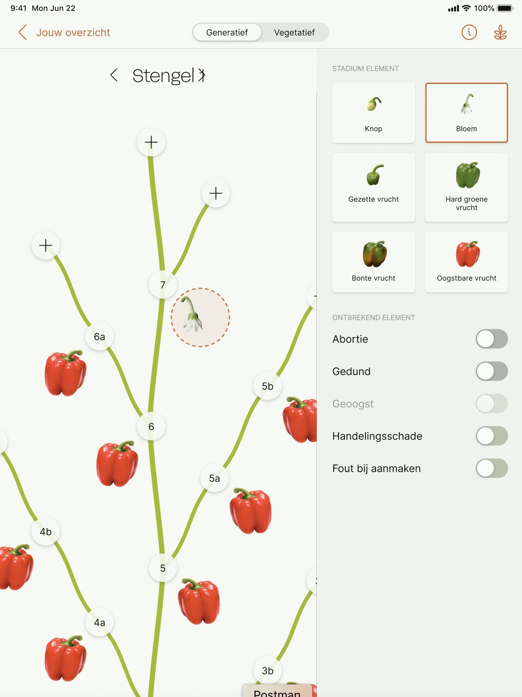
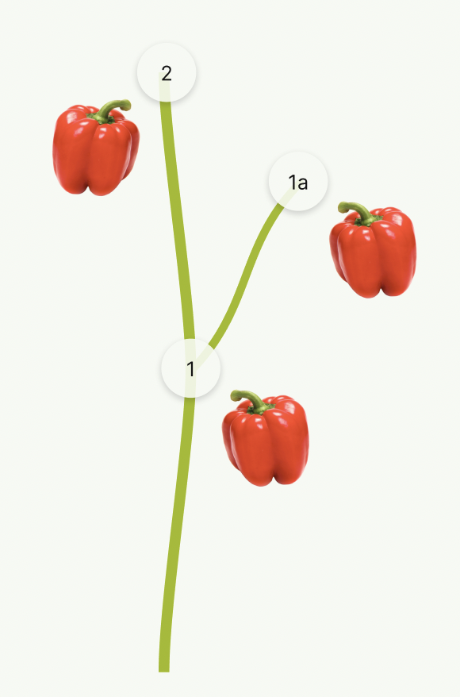
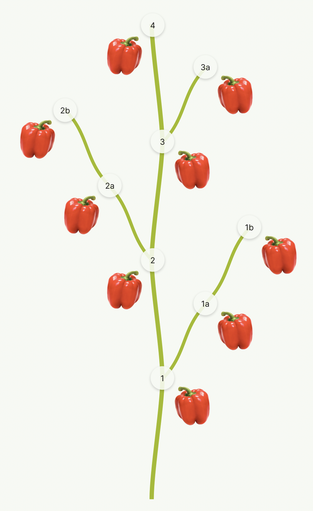

# Assignment: Digital Twin

The goal of this assignment is to verify that you can apply software engineering techniques in 
practice. To do so, we ask that you build a React Native app for a hypothetical part of our product.

## Instructions

To track the state of the plants in the greenhouses, growers can create a digital twin of a plant. This twin represents the state of the plant at the moment of the measurement.

The digital twin starts with a stem, containing branches which contains fruits (bell peppers in this example).


[](./design/digital-twin.png)

For this assignment you have to draw the digital twin, based on a data object. This data object contains the start of the stem (`root_node`), the children of this node, which can also contain children.

<br clear="right"/>
<br />

[](./design/harvestable-fruit.png)

When a fruit is selected, the sidebar opens, showing the status of the fruit. A fruit can have one of six fruit development stages. The different stages are described further in this assignment.

<br clear="right"/>
<br />

[](./design/flower.png)

The user can change the selected fruit development stage by selecting another stage.

Below the stages, there is a list of toggles. These toggles are not part of this assignment and can be ignored.

<br clear="right"/>

## Data

We will provide an API which will contain all data you need to complete this assignment.

### API

The data can be requested from the API:
api url...

### Data format

Example of the data object:
```
{
    "stems": [
        {
            "root_node": {
                "level": 1,
                "id": "1",
                "children": [
                    {
                        "level": 1,
                        "id": "2",
                        "children": [],
                        "fruits": [
                            {
                                "development_state": "HARVESTABLE_FRUIT",
                                "id": "fb532607-a858-4ad2-98f9-7aff6f682e92"
                            }
                        ]
                    },
                    {
                        "level": 2,
                        "id": "1a",
                        "children": [],
                        "fruits": [
                            {
                                "development_state": "HARVESTABLE_FRUIT",
                                "id": "fb532607-a858-4ad2-98f9-7aff6f682e92"
                            }
                        ]
                    }
                ],
                "fruits": [
                    {
                        "development_state": "HARVESTABLE_FRUIT",
                        "id": "fb532607-a858-4ad2-98f9-7aff6f682e92"
                    }
                ]
            }
        }
    ],
    "id": "7b02aa08-5f06-4ac5-ae2b-fb582a2e8372"
}
```

Each stem (for this assignment the API will always return only one single stem) starts with a `root_node`. The root node contains one or more children, which can also contain children.

The `level` of the child indicated if the child will (1) grow straight up or (2) is a branch of the parent.

This code example results in this small drawing (click to enlarge):<br />
[](./design/example-result.png)

As you can see in the data, the root node (node 1) has only two children. The first child (node 2) has level 1, so it will grow straight up. The second child (node 1a) has level 2, so it branches off into a separate branch.

With more data you should end up with a drawing like this:<br />
[](./design/result.png)

### Fruit development stages

Each node contains a list of fruit. For this assignment every node will have only one fruit.

The fruit object has a field `development_state` whit the current stage of the fruit in it.

This list shows the possible fruit development states.

| Image                                                                    | Development state   | Data value          |
|--------------------------------------------------------------------------|---------------------|---------------------|
|                  | Bud                 | BUD                 |
|               | Flower              | FLOWER              |
|            | Set fruit           | SET_FRUIT           |
|   | Mature green fruit  | MATURE_GREEN_FRUIT  |
|  | Breaker stage fruit | BREAKER_STAGE_FRUIT |
|    | Harvestable fruit   | HARVESTABLE_FRUIT   |

## Assets

This repository contains a directory `/assets/svg` where all required assets can be found.

## Requirements

Your solution should include the following functionality:

1. Consume the provided API to collect the data
2. Draw the plant based on the data from the API
3. Open a sidebar when a fruit is selected and show the fruit development stage
4. Let the user change the selected fruit development stage
5. Update the plant with the selected stage
6. Call the API to send the changed to the backend

### Non-functional requirements

- Use Typescript to build your assignment
- The app should be optimized for running on **tablets**
- Use the latest version of React Native
- This assignment was designed to be completed in 6-8h. The evaluation will take into account the 
  choices you make and what you focus on given the time you have. However, it's up to you if you 
  spend less or more time on it.
- Please make sure the final commit to your repository is done at least 24 hours before the start 
  of your interview

## Deliverables

This assignment should be delivered in the following way:

- All code is pushed to your private copy of this repository.
- Documentation is provided in the README.md on how the solution works, and how to run and test it.
- Any information, (dummy)-data, files, and other assets that are needed to run this project, are 
  provided in this repository.

## Assessment Criteria

The solution will be assessed on the following criteria:

- How is your code structured? Is it easy to read and follow?
- How clear is the documentation?
- Are there any clear bugs in your code?
- How does the solution perform?
- Can you clearly and concisely describe the process you have followed and the choices you have made?
- Can you describe the biggest short-comings of your solution and which steps could be taken to 
  improve on that?
